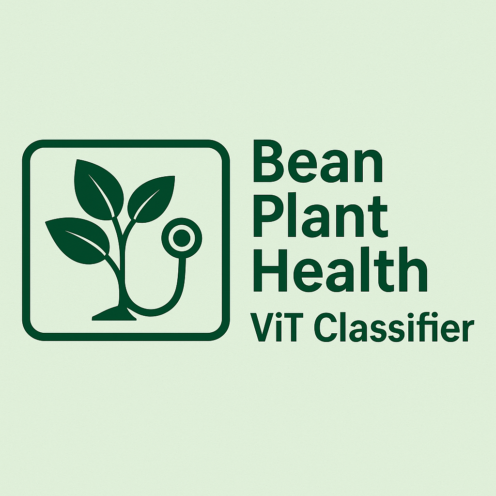

# Bean Plant Health ViT Classifier 🌱📸🩺

A web-based agricultural AI tool that helps farmers identify bean plant diseases using computer vision. Built with Vision Transformer (ViT) model and Gradio for real-time crop health monitoring and disease detection.



## 🚀 Live Demo

Try the app: [Bean-Plant-Health-Classifier](https://huggingface.co/spaces/ashish-soni08/Bean-plant-health-ViT-classifier)

## ✨ Features

- **Disease Detection**: Automatically identify angular leaf spot, bean rust, and healthy plants
- **Real-time Analysis**: Get instant classification results with confidence scores
- **Drone-Ready**: Designed for integration with drone technology for field monitoring
- **Clean Interface**: Intuitive web UI built with Gradio for farmers and agricultural professionals

## 🛠️ Technology Stack

- **Backend**: Python, Hugging Face Transformers
- **Frontend**: Gradio
- **Model**: [Vision Transformer (ViT-base)](https://huggingface.co/google/vit-base-patch16-224) fine-tuned on [Beans dataset](https://huggingface.co/datasets/beans)
- **Deployment**: Hugging Face Spaces

## 🏃‍♂️ Quick Start

### Prerequisites

```bash
Python 3.8+
pip
```

### Installation

1. Clone the repository:
```bash
git clone https://github.com/Ashish-Soni08/bean-plant-health-classifier.git
cd bean-plant-health-vit-classifier
```

2. Install dependencies:
```bash
pip install -r requirements.txt
```

3. Run the application:
```bash
python app.py
```

4. Open your browser and navigate to `http://localhost:7860`

## 📋 Usage

1. **Upload Image**: Click the image input field and upload a photo of a bean leaf
2. **Get Classification**: The app automatically analyzes the image and provides predictions
3. **View Results**: Check confidence scores for each disease category to make informed decisions

### Disease Categories

- **Angular Leaf Spot**: Fungal disease causing angular brown spots on leaves
- **Bean Rust**: Fungal disease creating rust-colored pustules on leaf surface
- **Healthy**: No visible signs of disease or infection

### Example

**Input Image:**
```
[Photo of bean leaf with brown spots]
```

**Output:**
```
Angular Leaf Spot: 87.5%
Bean Rust: 8.2%
Healthy: 4.3%
```

## 🧠 Model Information

This app uses **Vision Transformer (ViT-base)** fine-tuned for agricultural disease detection:

- **Architecture**: Vision Transformer with 16x16 patches, 224x224 input resolution  
- **Parameters**: ~86.6 million parameters
- **Training Data**: Beans dataset with 1,034 field images of bean leaves
- **Classes**: 3 categories (Angular Leaf Spot, Bean Rust, Healthy)
- **Base Model**: Pre-trained on ImageNet-21k, fine-tuned on beans disease dataset

## 📁 Project Structure

```
bean-plant-health-vit-classifier/
├── app.py                 # Main Gradio application
├── requirements.txt       # Python dependencies
├── README.md              # Project documentation
└── images/                # Sample bean leaf images for testing
```

## 🌾 Agricultural Impact

This tool helps farmers:
- **Early Disease Detection**: Identify problems before they spread
- **Reduce Crop Loss**: Take timely action to treat diseased plants
- **Optimize Treatment**: Focus resources on affected areas only
- **Scale Monitoring**: Use with drones for large-field surveillance

## 📄 License

This project is licensed under the Apache License 2.0

## 🙏 Acknowledgments

- [Hugging Face](https://huggingface.co/) for the Transformers library and model hosting
- [Gradio](https://gradio.app/) for the web interface framework
- [Google Research](https://github.com/google-research/vision_transformer) for the Vision Transformer architecture

## 📞 Contact

Ashish Soni - ashish.soni2091@gmail.com

Project Link: [github](https://github.com/Ashish-Soni08/bean-plant-health-classifier)
